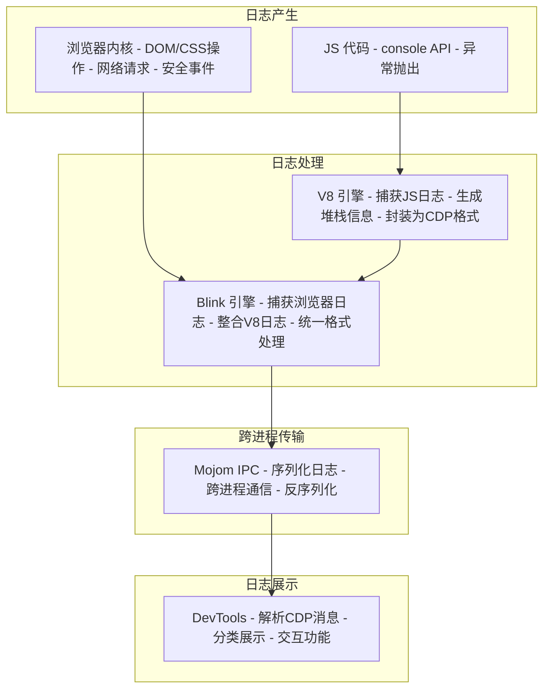

```mermaid
 graph TD
    
    classDef nodeStyle width:300px, text-align:center, white-space:nowrap;
    class A,B,C,D,E,F nodeStyle;
    
 
    subgraph 日志产生
        A[JS 代码 - console API - 异常抛出]
        B[浏览器内核 - DOM/CSS操作 - 网络请求 - 安全事件]
    end
    
 
    subgraph 日志处理
        C[V8 引擎 - 捕获JS日志 - 生成堆栈信息 - 封装为CDP格式]
        D[Blink 引擎 - 捕获浏览器日志 - 整合V8日志 - 统一格式处理]
    end
    
 
    subgraph 跨进程传输
        E[Mojom IPC - 序列化日志 - 跨进程通信 - 反序列化]
    end
    
  
    subgraph 日志展示
        F[DevTools - 解析CDP消息 - 分类展示 - 交互功能]
    end
    
    %% 流程关系（保持原逻辑）
    A --> C
    B --> D
    C --> D
    D --> E
    E --> F
 
```

