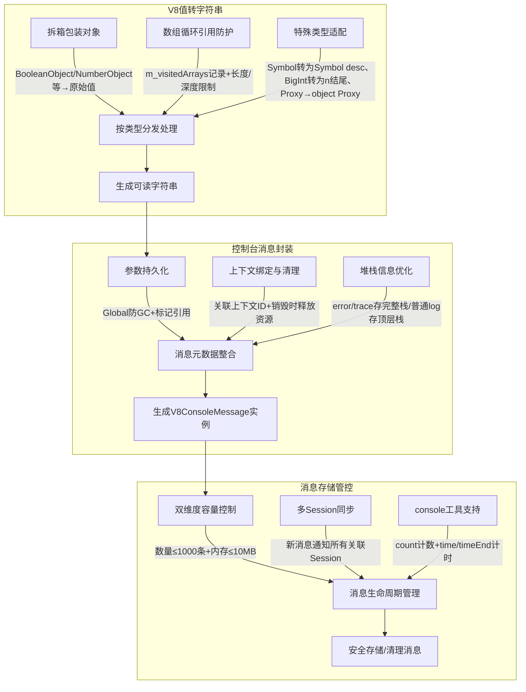

# 步骤一：V8引擎存储代码执行日志 
代码链接：[chromium/src/main:v8/src/inspector/v8-console-message.cc](https://source.chromium.org/chromium/chromium/src/+/main:v8/src/inspector/v8-console-message.cc;l=550;bpv=0;bpt=1?q=V8ConsoleMessageStorage&sq=)  

**作用**： 控制台消息的生命周期管理、v8类型转字符串、前端协议适配及资源安全管控 。

## 一、核心功能模块（重点内容）
### 1. V8 值转字符串：兼顾可读性与安全性（V8ValueStringBuilder）

#### 核心实现逻辑
- **拆箱包装对象**：自动将 `BooleanObject`/`NumberObject` 等包装类型拆为原始值（如 `new Boolean(true)` → `true`），避免展示 `[object Boolean]` 这类冗余格式。
- **数组循环引用防护**：用 `m_visitedArrays` 记录已处理数组，防止循环引用导致的死循环；同时限制数组最大展开项（10000 项）和递归深度（32 层），避免超长数组占用过多资源。
- **特殊类型适配**：
  - Symbol 格式化为 `Symbol(description)`（如 `Symbol('id')` 不展示为 `Symbol(id)`，保留语法辨识度）；
  - BigInt 末尾加 `n` 标识（如 `123n`），与 JS 语法保持一致；
  - Proxy 直接展示 `[object Proxy]`，避免代理对象内部逻辑暴露。

#### 关键代码
```cpp
class V8ValueStringBuilder {
 public:
  static String16 toString(v8::Local<v8::Value> value, v8::Local<v8::Context> context) {
    V8ValueStringBuilder builder(context);
    builder.append(value);
    return builder.toString();
  }

 private:
  explicit V8ValueStringBuilder(v8::Local<v8::Context> context)
      : m_arrayLimit(maxArrayItemsLimit), // 数组最大展开项：10000
        m_isolate(v8::Isolate::GetCurrent()),
        m_visitedArrays(v8::Isolate::GetCurrent()), // 防循环引用
        m_context(context) {}

  // 递归处理所有V8值类型
  bool append(v8::Local<v8::Value> value) {
    if (value.IsEmpty()) return true;
    // 拆箱包装对象
    if (value->IsBigIntObject()) value = value.As<v8::BigIntObject>()->ValueOf();
    else if (value->IsBooleanObject()) value = v8::Boolean::New(m_isolate, value.As<v8::BooleanObject>()->ValueOf());
    else if (value->IsNumberObject()) value = v8::Number::New(m_isolate, value.As<v8::NumberObject>()->ValueOf());
    // 按类型分发
    if (value->IsString()) return append(value.As<v8::String>());
    if (value->IsBigInt()) return append(value.As<v8::BigInt>());
    if (value->IsSymbol()) return append(value.As<v8::Symbol>());
    if (value->IsArray()) return append(value.As<v8::Array>());
    if (value->IsProxy()) { m_builder.append("[object Proxy]"); return true; }
    // 普通对象用 Object.prototype.toString() 兜底
    if (value->IsObject() && !value->IsDate() && !value->IsFunction() && !value->IsRegExp()) {
      v8::Local<v8::String> str;
      if (value.As<v8::Object>()->ObjectProtoToString(m_context).ToLocal(&str))
        return append(str);
    }
    // 兜底：调用 Value::ToString()
    v8::Local<v8::String> str;
    if (value->ToString(m_context).ToLocal(&str)) append(str);
    return true;
  }

  // 数组处理：防循环+长度限制
  bool append(v8::Local<v8::Array> array) {
    for (const auto& it : m_visitedArrays) if (it == array) return true; // 循环检测
    uint32_t len = array->Length();
    if (len > m_arrayLimit || m_visitedArrays.size() > maxStackDepthLimit) return false; // 超限终止

    m_arrayLimit -= len;
    m_visitedArrays.push_back(array);
    for (uint32_t i = 0; i < len; ++i) {
      if (i) m_builder.append(',');
      v8::Local<v8::Value> val;
      if (array->Get(m_context, i).ToLocal(&val)) append(val);
    }
    m_visitedArrays.pop_back();
    return true;
  }

  // Symbol 格式化：Symbol(description)
  bool append(v8::Local<v8::Symbol> symbol) {
    m_builder.append("Symbol(");
    append(symbol->Description(m_isolate));
    m_builder.append(')');
    return true;
  }

  // BigInt 加 'n' 标识
  bool append(v8::Local<v8::BigInt> bigint) {
    v8::Local<v8::String> str;
    if (bigint->ToString(m_context).ToLocal(&str)) append(str);
    m_builder.append('n');
    return true;
  }

  String16 toString() { return m_builder.toString(); }

  uint32_t m_arrayLimit;
  v8::Isolate* m_isolate;
  String16Builder m_builder; // 字符串拼接工具
  v8::LocalVector<v8::Array> m_visitedArrays; // 已访问数组（防循环）
  v8::Local<v8::Context> m_context;
};
```


### 2. 控制台消息封装：封装 `console` API 调用的完整元数据（参数、堆栈、上下文、时间戳）（V8ConsoleMessage）
#### 核心实现逻辑
- **参数持久化**：将 `console` 调用的参数转为 `v8::Global<v8::Value>`（全局引用），并通过 `AnnotateStrongRetainer` 标记为“控制台消息引用”，避免被 V8 GC 意外回收。
- **上下文绑定与清理**：消息关联具体的 V8 上下文 ID，当上下文销毁（如页面关闭、iframe 卸载）时，自动清空参数引用、重置上下文 ID，并标记消息为 `<message collected>`，防止内存泄漏。
- **堆栈信息优化**：仅为 `console.error`/`console.trace` 等关键类型保留完整堆栈，普通 `console.log` 仅保留顶层栈，平衡调试体验与性能开销。

#### 关键代码
```cpp
// 1. 为console API创建消息（核心：参数持久化+文本拼接）
std::unique_ptr<V8ConsoleMessage> V8ConsoleMessage::createForConsoleAPI(
    v8::Local<v8::Context> v8Context, int contextId, int groupId,
    V8InspectorImpl* inspector, double timestamp, ConsoleAPIType type,
    v8::MemorySpan<const v8::Local<v8::Value>> arguments,
    const String16& consoleContext, std::unique_ptr<V8StackTraceImpl> stackTrace) {
  v8::Isolate* isolate = v8::Isolate::GetCurrent();
  auto message = std::make_unique<V8ConsoleMessage>(V8MessageOrigin::kConsole, timestamp, String16());

  // 绑定堆栈信息（URL、行号）
  if (stackTrace && !stackTrace->isEmpty()) {
    message->m_url = toString16(stackTrace->topSourceURL());
    message->m_lineNumber = stackTrace->topLineNumber();
  }
  message->m_stackTrace = std::move(stackTrace);
  message->m_contextId = contextId;

  // 持久化参数（Global<Value>防GC，标记引用用途）
  for (v8::Local<v8::Value> arg : arguments) {
    auto globalArg = std::make_unique<v8::Global<v8::Value>>(isolate, arg);
    globalArg->AnnotateStrongRetainer(kGlobalConsoleMessageHandleLabel); // 标记引用场景
    message->m_arguments.push_back(std::move(globalArg));
    message->m_v8Size += v8::debug::EstimatedValueSize(isolate, arg); // 统计内存
  }

  // 拼接参数为可读文本（如console.log(1, "a") → "1 a"）
  bool sep = false;
  for (v8::Local<v8::Value> arg : arguments) {
    if (sep) message->m_message += " ";
    else sep = true;
    message->m_message += V8ValueStringBuilder::toString(arg, v8Context);
  }

  // 通知客户端（如浏览器）有console消息
  inspector->client()->consoleAPIMessage(
      groupId, clientLevel, toStringView(message->m_message),
      toStringView(message->m_url), message->m_lineNumber, 0, message->m_stackTrace.get());
  return message;
}

// 2. 上下文销毁时清理资源（防内存泄漏）
void V8ConsoleMessage::contextDestroyed(int contextId) {
  if (contextId != m_contextId) return;
  m_contextId = 0;
  m_message = m_message.isEmpty() ? "<message collected>" : m_message; // 标记回收
  Arguments empty;
  m_arguments.swap(empty); // 释放Global<Value>引用，允许GC
  m_v8Size = 0;
}
```


### 3. 消息存储：容量与生命周期管控（V8ConsoleMessageStorage）

#### 核心实现逻辑
- **双维度容量控制**：
  - 数量限制：最多存储 1000 条消息，超过则移除最早的消息；
  - 内存限制：总内存不超过 10MB（`maxConsoleMessageV8Size`），超限则逐步删除旧消息，避免占用过多内存。
- **多 Session 同步**：新消息添加时，自动通知该上下文组下的所有 Inspector Session（如多个 DevTools 窗口），确保调试体验一致。
#### 关键代码
```cpp
// 1. 添加消息（容量控制+多Session同步）
void V8ConsoleMessageStorage::addMessage(std::unique_ptr<V8ConsoleMessage> message) {
  // 处理console.clear()
  if (message->type() == ConsoleAPIType::kClear) clear();

  // 通知所有关联Session（如多个DevTools窗口）
  m_inspector->forEachSession(m_contextGroupId, [&](V8InspectorSessionImpl* session) {
    if (message->origin() == V8MessageOrigin::kConsole)
      session->consoleAgent()->messageAdded(message.get());
    session->runtimeAgent()->messageAdded(message.get());
  });

  // 不存储则直接返回
  if (!m_inspector->hasConsoleMessageStorage(m_contextGroupId)) return;

  // 数量限制：最多1000条
  if (m_messages.size() == maxConsoleMessageCount) {
    m_estimatedSize -= m_messages.front()->estimatedSize();
    m_messages.pop_front();
  }

  // 内存限制：最多10MB
  while (m_estimatedSize + message->estimatedSize() > maxConsoleMessageV8Size && !m_messages.empty()) {
    m_estimatedSize -= m_messages.front()->estimatedSize();
    m_messages.pop_front();
  }

  // 添加新消息
  m_messages.push_back(std::move(message));
  m_estimatedSize += m_messages.back()->estimatedSize();
}

// 2. console.count实现（按分组计数）
int V8ConsoleMessageStorage::count(int contextId, int consoleContextId, const String16& label) {
  return ++m_data[contextId].m_counters[LabelKey{consoleContextId, label}];
}

// 3. console.time/timeEnd实现（计时生命周期）
bool V8ConsoleMessageStorage::time(int contextId, int consoleContextId, const String16& label) {
  // try_emplace：不存在则添加，返回是否成功（避免重复计时）
  return m_data[contextId].m_timers
      .try_emplace(LabelKey{consoleContextId, label}, m_inspector->client()->currentTimeMS())
      .second;
}

std::optional<double> V8ConsoleMessageStorage::timeEnd(int contextId, int consoleContextId, const String16& label) {
  auto& timers = m_data[contextId].m_timers;
  auto it = timers.find({consoleContextId, label});
  if (it == timers.end()) return std::nullopt; // 未启动则返回空
  double cost = m_inspector->client()->currentTimeMS() - it->second;
  timers.erase(it); // 结束后移除计时
  return cost;
}
```

