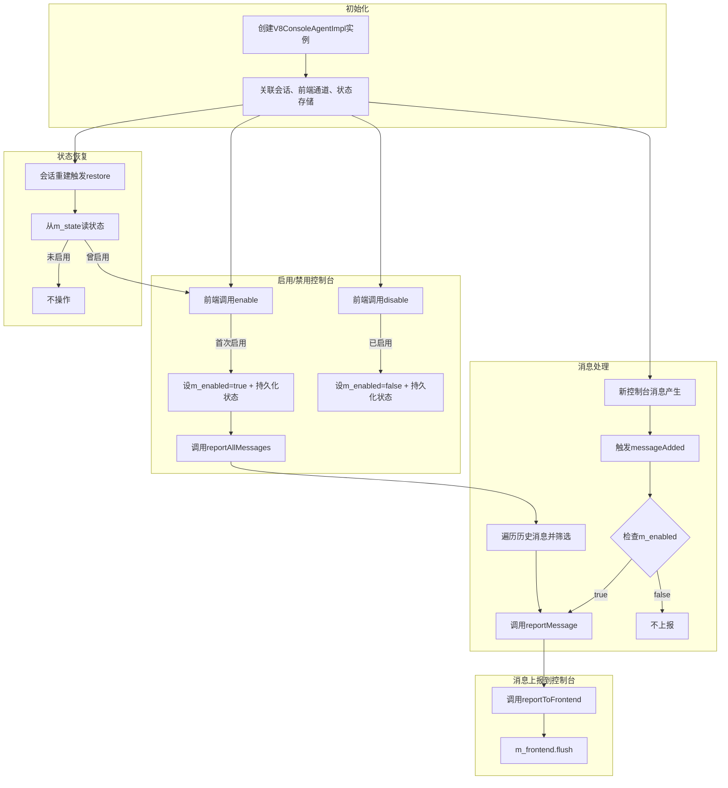

#### [https://source.chromium.org/chromium/chromium/src/+/main:v8/src/inspector/v8-console-agent-impl.cc;bpv=0;bpt=0](https://source.chromium.org/chromium/chromium/src/+/main:v8/src/inspector/v8-console-agent-impl.cc;bpv=0;bpt=0)

这段代码实现了V8 Inspector中**控制台代理（ConsoleAgent）** 的核心逻辑，负责管理控制台消息的启用/禁用、消息上报及状态恢复
## 一、核心角色与依赖
- **依赖**：
  - `V8InspectorSessionImpl`：关联的Inspector会话，提供上下文和消息存储访问；
  - `protocol::FrontendChannel`：前端通信通道，用于向前端发送控制台消息；
  - `V8ConsoleMessageStorage`：控制台消息的存储容器，用于获取历史消息。

## 三、核心方法逻辑

### 1. 启用/禁用控制台（`enable`/`disable`）
```cpp
// 启用控制台：开始向前端上报消息
Response V8ConsoleAgentImpl::enable() {
  if (m_enabled) return Response::Success(); // 避免重复启用
  m_state->setBoolean(ConsoleAgentState::consoleEnabled, true); // 持久化状态
  m_enabled = true;
  reportAllMessages(); // 上报启用前已存储的历史消息
  return Response::Success();
}

// 禁用控制台：停止向前端上报消息
Response V8ConsoleAgentImpl::disable() {
  if (!m_enabled) return Response::Success(); // 避免重复禁用
  m_state->setBoolean(ConsoleAgentState::consoleEnabled, false); // 持久化状态
  m_enabled = false;
  return Response::Success();
}
```
- **核心逻辑**：通过`m_enabled`标志控制消息上报开关，并将状态持久化到`m_state`中，确保会话重启后状态一致；
- **启用时的特殊处理**：调用`reportAllMessages()`，将启用前已存储的历史消息一次性上报给前端（如DevTools打开时，显示之前的`console`输出）。

### 2. 状态恢复（`restore`）
```cpp
void V8ConsoleAgentImpl::restore() {
  // 从持久化状态中恢复启用状态
  if (!m_state->booleanProperty(ConsoleAgentState::consoleEnabled, false))
    return;
  enable(); // 若之前是启用状态，则重新启用
}
```
- **作用**：当Inspector会话重建时（如页面刷新但DevTools保持打开），从`m_state`中读取之前的启用状态并恢复，避免用户需要重新手动启用控制台。

### 3. 消息上报触发（`messageAdded`）
```cpp
void V8ConsoleAgentImpl::messageAdded(V8ConsoleMessage* message) {
  if (m_enabled) reportMessage(message, true); // 仅当启用时才上报新消息
}
```
- **触发时机**：当有新的控制台消息（如`console.log`调用）产生时，由`V8ConsoleMessageStorage`调用；
- **条件上报**：仅在`m_enabled`为`true`时（即前端已启用控制台），才调用`reportMessage`向前端发送消息。

### 4. 消息上报实现（`reportMessage`与`reportAllMessages`）
```cpp
// 上报单条消息
bool V8ConsoleAgentImpl::reportMessage(V8ConsoleMessage* message, bool generatePreview) {
  DCHECK_EQ(V8MessageOrigin::kConsole, message->origin()); // 确保是控制台消息
  message->reportToFrontend(&m_frontend); // 调用消息自身的上报方法
  m_frontend.flush(); // 立即刷新前端通道，确保消息及时发送
  // 检查消息存储是否仍有效（避免上下文已销毁的情况）
  return m_session->inspector()->hasConsoleMessageStorage(m_session->contextGroupId());
}

// 上报所有历史消息（启用时调用）
void V8ConsoleAgentImpl::reportAllMessages() {
  // 获取当前上下文组的消息存储
  V8ConsoleMessageStorage* storage = m_session->inspector()->ensureConsoleMessageStorage(m_session->contextGroupId());
  // 遍历所有历史消息，仅上报控制台来源的消息
  for (const auto& message : storage->messages()) {
    if (message->origin() == V8MessageOrigin::kConsole) {
      if (!reportMessage(message.get(), false)) return; // 上报失败则终止
    }
  }
}
```
- **单条消息上报**：调用`V8ConsoleMessage`的`reportToFrontend`方法，按协议格式向前端发送消息，并立即刷新通道确保实时性；
- **历史消息批量上报**：启用控制台时，从`V8ConsoleMessageStorage`中读取所有历史控制台消息，逐条上报给前端，确保前端能看到完整的消息历史。

## 四、整体工作流程


