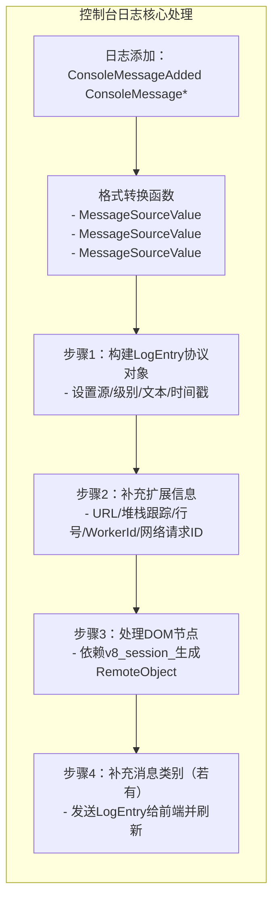

步骤四：blink通过mojom转发日志给devtools

# blink的日志模型

> 代码链接：[https://source.chromium.org/chromium/chromium/src/+/main:third_party/blink/renderer/core/inspector/console_message.cc](https://source.chromium.org/chromium/chromium/src/+/main:third_party/blink/renderer/core/inspector/console_message.cc)

> 作用：封装控制台单条消息的来源、级别、内容、源代码位置、关联网络请求 / Worker/DOM 节点等核心元信息。

# blink通过mojom转发日志给devtools

> 代码链接：[https://source.chromium.org/chromium/chromium/src/+/main:third_party/blink/renderer/core/inspector/inspector_log_agent.cc;bpv=0;bpt=1](https://source.chromium.org/chromium/chromium/src/+/main:third_party/blink/renderer/core/inspector/inspector_log_agent.cc;bpv=0;bpt=1)

> 作用：  接收 Blink 内部的控制台日志（如 JS 错误、网络日志）并转换为 DevTools 协议格式推给前端

## 核心功能模块

|   |   |
|---|---|
|依赖模块|核心作用|
|`ConsoleMessageStorage`|blink存储的日志信息|
|`PerformanceMonitor`|检测性能违规（如长任务、强制回流），触发时生成违规日志|
|`V8InspectorSession`|负责处理单个连接（如一个 DevTools 窗口）的调试指令（如暂停 / 继续代码、包装 JS 对象）|
|`ConsoleMessage`|Blink 内部日志模型|

### 1. 日志来源与级别转换

Blink 内部日志分类（来源、级别）与 DevTools 前端协议通过两个核心函数统一格式：

#### 日志来源/级别转换（MessageSourceValue、MessageLevelValue）

```
String MessageSourceValue(mojom::blink::ConsoleMessageSource source) {
  switch (source) {
    case mojom::blink::ConsoleMessageSource::kXml: return protocol::Log::LogEntry::SourceEnum::Xml;
    case mojom::blink::ConsoleMessageSource::kJavaScript: return protocol::Log::LogEntry::SourceEnum::Javascript;
    case mojom::blink::ConsoleMessageSource::kNetwork: return protocol::Log::LogEntry::SourceEnum::Network;
    // 其他来源（存储、渲染、安全等）转换逻辑...
    default: return protocol::Log::LogEntry::SourceEnum::Other;
  }
}

String MessageLevelValue(mojom::blink::ConsoleMessageLevel level) {
  switch (level) {
    case mojom::blink::ConsoleMessageLevel::kVerbose: return protocol::Log::LogEntry::LevelEnum::Verbose;
    case mojom::blink::ConsoleMessageLevel::kInfo: return protocol::Log::LogEntry::LevelEnum::Info;
    case mojom::blink::ConsoleMessageLevel::kWarning: return protocol::Log::LogEntry::LevelEnum::Warning;
    case mojom::blink::ConsoleMessageLevel::kError: return protocol::Log::LogEntry::LevelEnum::Error;
  }
  return protocol::Log::LogEntry::LevelEnum::Info;
}

```

作用：

### 2. 日志的启用与初始化（`enable` + `InnerEnable`）

当用户打开 DevTools Log 面板时，前端发送 `enable` 指令，启用后立即注册日志监听，并将历史日志和过期日志通知前端，实现“打开面板即见历史记录”的效果

```
// 响应前端"启用日志"指令
protocol::Response InspectorLogAgent::enable() {
  if (enabled_.Get()) return protocol::Response::Success();
  enabled_.Set(true);
  InnerEnable(); // 执行实际初始化
  return protocol::Response::Success();
}

// 实际初始化逻辑
void InspectorLogAgent::InnerEnable() {
  // 1. 注册到Blink日志系统，后续日志会回调ConsoleMessageAdded
  instrumenting_agents_->AddInspectorLogAgent(this);

  // 2. 处理过期日志（告知前端有日志被丢弃）
  if (storage_->ExpiredCount()) {
    auto expired = protocol::Log::LogEntry::create()
        .setSource(protocol::Log::LogEntry::SourceEnum::Other)
        .setLevel(protocol::Log::LogEntry::LevelEnum::Warning)
        .setText(StrCat({String::Number(storage_->ExpiredCount()), " log entries are not shown."}))
        .build();
    GetFrontend()->entryAdded(std::move(expired)); // 推送给前端
  }

  // 3. 加载并转发历史日志（确保前端能看到打开面板前的日志）
  for (wtf_size_t i = 0; i < storage_->size(); ++i)
    ConsoleMessageAdded(storage_->at(i));
}
```

### 3. 新日志的接收与转发（`ConsoleMessageAdded`）

将 Blink 的 `ConsoleMessage` 转换为 DevTools 协议的 `LogEntry`，补充 URL、堆栈等细节，最终推给前端显示。

```
void InspectorLogAgent::ConsoleMessageAdded(ConsoleMessage* message) {
  DCHECK(enabled_.Get()); // 确保日志已启用

  // 1. 构建基础日志对象（来源、级别、文本、时间戳）
  auto entry = protocol::Log::LogEntry::create()
      .setSource(MessageSourceValue(message->GetSource())) // 转换来源
      .setLevel(MessageLevelValue(message->GetLevel()))   // 转换级别
      .setText(message->Message())                        // 日志文本
      .setTimestamp(message->Timestamp())                 // 时间戳
      .build();

  // 2. 补充扩展信息（URL、堆栈、行号等）
  if (!message->Location()->Url().empty())
    entry->setUrl(message->Location()->Url()); // 日志来源URL（如报错脚本地址）
  auto stack_trace = message->Location()->BuildInspectorObject(); // 堆栈信息
  if (stack_trace) entry->setStackTrace(std::move(stack_trace));
  if (message->Location()->LineNumber())
    entry->setLineNumber(message->Location()->LineNumber() - 1); // 行号适配

  // 3. 处理DOM关联日志（如console.dir(document)）
  if (v8_session_ && message->Frame() && !message->Nodes().empty()) {
    auto remote_objects = std::make_unique<protocol::Array<...>>();
    for (DOMNodeId node_id : message->Nodes()) {
      Node* node = DOMNodeIds::NodeForId(node_id); // 获取DOM节点
      // 生成前端可定位的"远程对象"（点击日志跳转到Elements面板）
      auto remote_object = ResolveNode(v8_session_, node, "console", std::nullopt);
      remote_objects->emplace_back(std::move(remote_object));
    }
    entry->setArgs(std::move(remote_objects));
  }

  // 4. 推送给前端，完成转发
  GetFrontend()->entryAdded(std::move(entry));
  GetFrontend()->flush();
}
```

整体工作流程

  

 